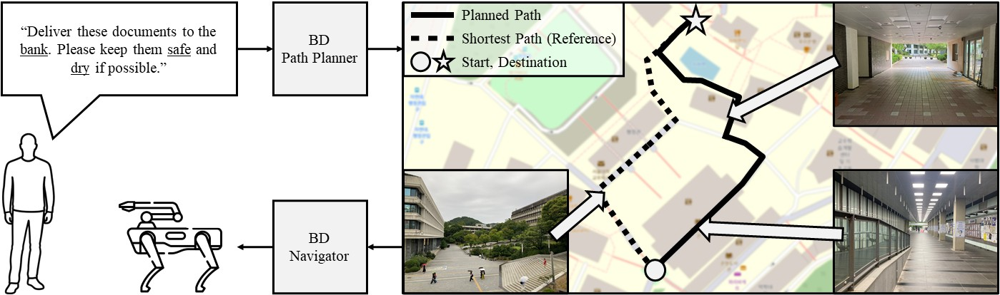
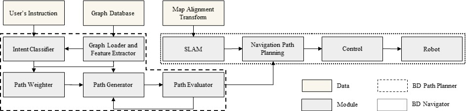
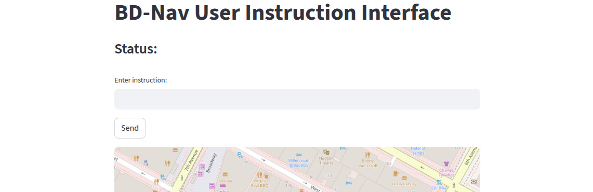
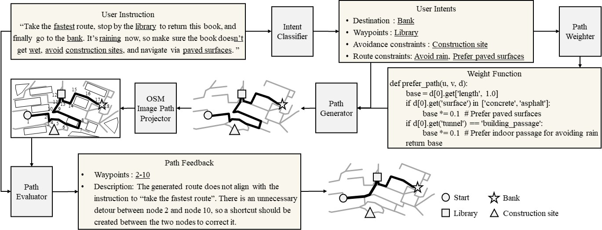

# Beyond Destinations: Instruction-Aware Graph Path Planning and Navigation with OpenStreetMap

[Donghwi Jung](https://donghwijung.github.io/), Jihun Moon, Jiyang Lee, DongYeop Shin, Jungjae Lee, Jinhee Kim, Mingyu Kim [Seong-Woo Kim](https://arisnu.squarespace.com/director)

We present **BD-Nav**, a navigation framework that uses large language models (LLMs) and OpenStreetMap (OSM) data to generate routes based on free-form natural language instructions. BD-Nav goes beyond identifying destinations by considering user-specified conditions such as safety, weather, and avoidance constraints. Validated through real-world experiments with a quadruped robot, it provides accurate, robust, and user-centered navigation without requiring pre-built maps.

## Concept
<p align="center">
  
</p>

## System Overview
<p align="center">
  
</p>


## Table of Contents
- [Requirements](#requirements)
- [Setup](#setup)
- [Execution](#execution)
- [Modules](#modules)
    - [Path Generation](#path-generation)
    - [Additional Features](#additional-features)


## Requirements
Ubuntu 22.04, ROS2 (Humble)


## Install
```bash
git clone git@github.com:donghwijung/bd_nav.git
cd bd_nav
conda env create -f environment.yaml
conda activate bd_nav
sudo apt update
sudo apt install fonts-nanum
colcon build
```

## Execution
### Environment Setup
After opening the terminal, these commands only need to be run once initially. If you add the command below to your `.bashrc`, you won’t need to run it every time.
```bash
source install/setup.bash
export PYTHONPATH=$CONDA_PREFIX/lib/python3.10/site-packages:$PYTHONPATH
```

> 💡 You can run all the commands needed for the initial setup at once.
```bash
source ./setting.sh
```

### OpenAI API Key Issuance and Environment Variable Setup
To run the LLM and VLM, first obtain an API key from the [OpenAI website](https://platform.openai.com/api-keys).  
Then, set it as an environment variable using the command below.  
For frequent use, it is recommended to add this line to your `.bashrc` file for automatic configuration.

```bash
export OPENAI_API_KEY="<YOUR_OPENAI_API_KEY>"
```

### Running ROS modules
```bash
ros2 launch bd_nav run.launch.py
```

### GPS coordinate transmission
```bash
ros2 topic pub /gps/fix sensor_msgs/msg/NavSatFix "
header:
  stamp:
    sec: 0
    nanosec: 0
  frame_id: 'gps_link'
status:
  status: 0
  service: 1
latitude: 40.7553098
longitude: -73.9848042
altitude: 50.0
position_covariance: [0.0, 0.0, 0.0, 0.0, 0.0, 0.0, 0.0, 0.0, 0.0]
position_covariance_type: 0
" --once
```

### User Instruction Input
Refer to the OSM map loaded based on GPS coordinates, enter the desired driving instruction in the text input box, and press the Send button to submit.
<p align="center">
  
</p>


## Modules
### Path Generation
<p align="center">
  
</p>
When the user enters an instruction, the **Intent Classifier** searches for nearby places within a 300 meter radius to find the one that best matches the intended destination and extracts any route-related conditions. Then, the **Path Weighter** converts the natural language conditions into a Python function. Finally, the **Path Generator** uses the destination and the generated path function to compute a route that satisfies the user's instruction.

#### Intent Classifier
Identifies the destination and any route-related constraints from a user instruction, by checking whether any of the nearby places (within 300 meters) in the OSM dataset match the described destination.
```bash
ros2 run bd_nav intent_classifier
```
#### Path Weighter
Generates a "prefer_path" Python weight function based on the natural language constraints extracted from the user instruction. This function is used in path planning.
```bash
ros2 run bd_nav path_weighter
```
#### Path Generator
Generates a custom path based on the user's destination and constraints using **osmnx** and **networkx**. Compares the generated path to the default shortest path and publishes route data and distance.
```bash
ros2 run bd_nav path_generator
```
#### Path Evaluator
Validates the generated route against the user instruction and emits a minimal directive only when needed.
1. If the route already matches: output yes (no change).
2. If instruction contains “nearest”: set destination that best matches the place and is nearest to the start.
3. If instruction contains “fastest route”: connect a shortcut
```bash
ros2 run bd_nav path_evaluator
```

### Additional Features
#### User Input : Interactive Route Planner
Specify your destination in natural language (e.g., “Go to the library without getting wet” or “Avoid stairs and head to Jaha-yeon”), and the system will analyze your intent, apply relevant constraints, and generate the optimal route.

This feature is provided through a Streamlit-based UI, which supports:

- Continuous Route Modification: Add/remove waypoints, set avoidance areas, or change route conditions (Avoid Stairs, Prefer pedestrian road, etc.)
- Route Confirmation: type 'yes' → confirm
- Status Display: Shows 1st–4th ranked destination candidates, the currently selected route, and applied constraints
```bash
ros2 run bd_nav ui
```

#### Map Generation
Create a pedestrian network graph from a specified place name and map radius using graph_from_address() in map_generator.py. The generated map is saved as map.graphml in the install directory of the ROS2 package, where it remains permanently available unless manually deleted.
```bash
ros2 run bd_nav map_generator
```

#### Map Viewer
Visualizes the map generated by map_generator on the Streamlit UI. It provides a real-time interactive interface where users can specify destinations and constraints in natural language. Each user input is interpreted, processed into a route, and immediately reflected on the map display.
```bash
ros2 run bd_nav map_viewer
```

<!-- ## Citation
```
``` -->

## License

Copyright 2025, Donghwi Jung, Jihun Moon, Jiyang Lee, DongYeop Shin, Jungjae Lee, Jinhee Kim, Seong-Woo Kim, Autonomous Robot Intelligence Lab, Seoul National University.

This project is free software made available under the MIT License. For details see the LICENSE file.
